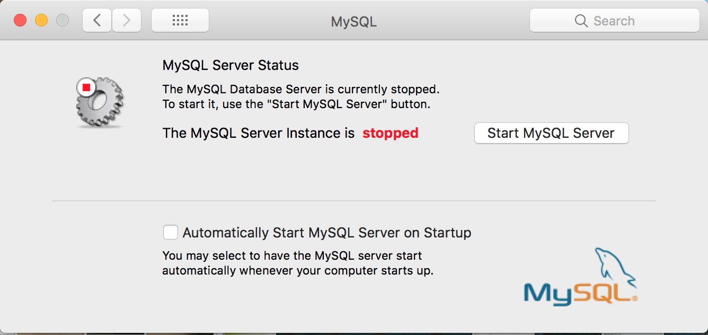
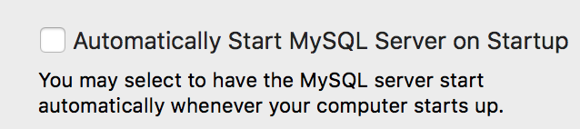

# MySQL install on OSX

Based on instructions from here: https://dev.mysql.com/doc/refman/5.7/en/osx-installation.html


## Install the Server

Following step [2.4.2](https://dev.mysql.com/doc/refman/5.7/en/osx-installation-pkg.html)  download the .dmg image from [here](https://dev.mysql.com/downloads/mysql/)

On the download screen, you can skip login by clicking this at the bottom of the page:

```
No thanks, just start my download.
```

Make sure you write down the temporary password it creates in Step 7, you will need it soon.

## Configure Server to start

Step [2.4.3 Installing a MySQL Launch Daemon](https://dev.mysql.com/doc/refman/5.7/en/osx-installation-launchd.html)

Follow the steps explaining how to use System Preferences.



At this step, do no select the box for automatically starting up the server. Otherwise you will have MySQL running every time you use your computer.



## Prepare your command line to work

Update your bash profile

```
echo 'export PATH=/usr/local/mysql/bin:$PATH' >> ~/.bash_profile
```

exit the terminal session and start a new one.

## Change the MySQL root user password

Login to mysql as the root user.

```
mysql -h localhost -u root -p
```

_Use the password you wrote down earlier_

You will see a screen like this

```
Enter password: 
Welcome to the MySQL monitor.  Commands end with ; or \g.
Your MySQL connection id is 90
Server version: 5.7.21

Copyright (c) 2000, 2018, Oracle and/or its affiliates. All rights reserved.

Oracle is a registered trademark of Oracle Corporation and/or its
affiliates. Other names may be trademarks of their respective
owners.

Type 'help;' or '\h' for help. Type '\c' to clear the current input statement.

mysql>
```

Using the `mysql>` propmpt, reset the root password:

```
ALTER USER 'root'@'localhost' IDENTIFIED BY '<your new password>';
```
